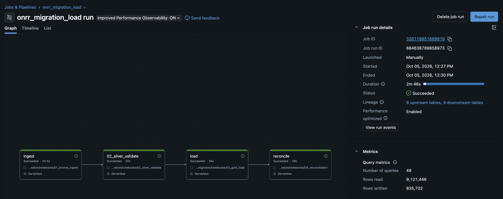
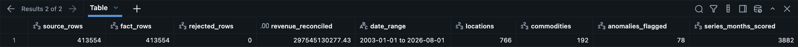

# ONRR Revenue Data Migration (Databricks, Delta Lake)

Migration of U.S. federal oil, gas and mineral revenue transactions from a flat-file extract into a
Delta Lake star schema, with row-level validation, an idempotent MERGE load and a source-to-target
reconciliation that must pass before the load is signed off.

The source is the Office of Natural Resources Revenue (ONRR) monthly revenue file: royalties, rents,
bonuses and other revenue collected on federal and Native American leases, January 2003 to present.
It is public data, published by the U.S. Department of the Interior at
[revenuedata.onrr.gov](https://revenuedata.onrr.gov/downloads/revenue/).

## Scope

| | |
|---|---|
| Source | `monthly_revenue.csv`, one row per month, location, revenue type and commodity |
| Target | Delta tables in `workspace.onrr_migration` (Unity Catalog) |
| Platform | Databricks Free Edition, serverless compute, PySpark and Spark SQL |
| Orchestration | Databricks job: ingest → validate → load → reconcile |
| Reporting | Databricks AI/BI dashboard (`sql/dashboard_queries.sql`) |

## Pipeline

The layers follow the Databricks medallion convention (bronze, silver, gold). In migration terms
they are the landing, staging and target areas.

```
monthly_revenue.csv
   │
   │ 01  Land the extract unchanged, add audit columns
   ▼
bronze_monthly_revenue            landing: all columns as text, row hash, source row id
   │
   │ 02  Type, cleanse and validate
   ├─────────────► silver_revenue_rejects   rows that failed a rule, with reason codes
   ▼
silver_revenue_txn                staging: typed and standardised
   │
   │ 03  Build dimensions, MERGE the fact table
   ▼
fact_revenue_txn                  target star schema
   ├── dim_date          (federal fiscal year, Oct to Sep)
   ├── dim_location
   ├── dim_commodity
   └── dim_revenue_type
   │
   │ 04  Reconcile source to target, fail the job on any variance
   ▼
recon_results
```

| Notebook | Purpose |
|---|---|
| `00_config` | Catalog, schema, file path and the shared amount-parsing rule |
| `00_recon_lib` | Reconciliation checks, used by 04 and 05 |
| `01_bronze_ingest` | Load the CSV as-is with audit columns |
| `02_silver_validate` | Data typing, validation rules, reject routing |
| `03_gold_load` | Dimension loads and the fact `MERGE` |
| `04_reconciliation` | Sign-off checks; raises an error if any check fails |
| `05_defect_injection_demo` | Breaks a copy of the fact table to confirm the checks detect each defect |
| `06_ai_anomaly_detection` | Flags unusual monthly revenue for analyst review (Isolation Forest) |

## Validation rules

Every landed row ends up in exactly one of the two staging tables. Nothing is dropped without a reason.

| Code | Rule | Action |
|---|---|---|
| V001 | Date cannot be parsed | Reject |
| V002 | Revenue amount is not numeric | Reject |
| V003 | Revenue type missing | Reject |
| V004 | Land class missing | Reject |
| V005 | Date in the future | Reject |
| D001 | Commodity or product blank | Default to `Not Applicable` |
| W001 | Exact duplicate source row | Flag only; aggregated rows can repeat legitimately |

## Load design

- Dimension surrogate keys are hashes of the business attributes, so a re-run produces the same keys.
- The fact table is loaded with a single `MERGE`: new rows are inserted, changed amounts are updated
  and rows no longer in the source are deleted. Running the load twice changes nothing.
- Each fact row carries a `txn_id` (content hash plus occurrence number) and the source row id, so any
  target row can be traced back to the extract.
- Delta table history records every load and allows a rollback to a previous version.

## Reconciliation

The source side of the reconciliation re-reads the raw file directly rather than the landing table,
so an ingestion error cannot hide itself.

| ID | Check |
|---|---|
| C01 | Row count: source file vs landing table |
| C02 | Row count: landing = valid + rejected |
| C03 | Row count: valid staging rows vs fact table |
| C04 | Revenue total: source file vs fact + rejected amounts |
| C05 | Revenue total: valid staging rows vs fact table |
| C06 | Revenue by fiscal year and revenue type: no group with a variance |
| C07 | No source transaction missing from the target |
| C08 | No target transaction that is not in the source |
| C09 | Every fact row joins to all four dimensions |
| C10 | Reject rate below 1% |

Results are appended to `recon_results` with a run id, so every sign-off is kept.

Notebook 05 copies the fact table, introduces four common migration defects (dropped rows, a one-cent
amount change, a duplicated row and a broken foreign key) and reruns the checks against the copy.

| Defect | Checks expected to fail |
|---|---|
| 3 transactions dropped | C03, C04, C05, C07 |
| One amount changed by $0.01 | C04, C05, C06 |
| One duplicate row | C03, C05, C08 |
| One invalid commodity key | C09 |

## Anomaly detection

Reconciliation confirms the data moved correctly; it does not say whether the numbers make sense.
Notebook 06 builds monthly series for the largest commodity and revenue type combinations, scores each
month against its trailing 12-month median and month-over-month change, and runs an Isolation Forest
on those features. A month is flagged when the model and the robust z-score agree. Results go to
`gold_revenue_anomalies`.

## Results

Run on Databricks Free Edition (serverless), October 2026, against the ONRR file covering
January 2003 to August 2026.

| Measure | Value |
|---|---|
| Source rows | 413,554 |
| Rows loaded to `fact_revenue_txn` | 413,554 |
| Rows rejected by validation | 0 |
| Revenue reconciled, source to target | $297,545,130,277.43 |
| Location / commodity dimension rows | 766 / 192 |
| Reconciliation checks passed | 10 of 10 |
| Months flagged for review (notebook 06) | 78 of 3,882 series-months |
| Scheduled job, ingest to reconcile | 4 tasks, 2 min 46 s |

The source file contained no rows that failed a validation rule, so the reject table is empty. The
defect-injection run in notebook 05 is what confirms the checks detect errors.

**Job run (01 → 02 → 03 → 04)**



**Summary query**



## Running it

1. In Databricks, go to **Workspace → Create → Git folder** and add this repository.
2. Open `notebooks/01_bronze_ingest`, attach serverless compute and run it. It creates the schema and
   volume and tries to download the file. If outbound access is blocked, download
   `monthly_revenue.csv` from the ONRR link above and upload it to
   **Catalog → workspace → onrr_migration → raw**.
3. Run notebooks 02 to 06 in order.
4. Optionally, create a job with tasks 01 → 02 → 03 → 04 and build the dashboard from
   `sql/dashboard_queries.sql`.
